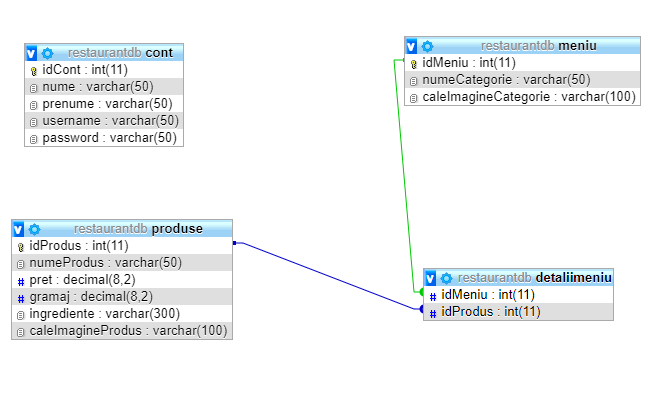

# Specificații pentru aplicația restaurant
* ## __Prezentare generală__
### Aplicația noastră este o aplicație care ține evidența meniurilor din cadrul unui restaurant. Aplicația trebuie să conțină o parte pentru administrator, în care acesta poate să gestioneze, să adauge și să șteargă meniurile, și o parte pentru vizitatori, în care aceștia văd meniurile fără a le modifica.
### În figura următoare este prezentată o schiță a site-ului:

* ## __Conținutul aplicației__
### Orice pagină html din cadrul aplicației va conține un header (care cuprinde numele restaurantului, bara de navigație și o parte de login, iar imediat după acestea se află o imagine reprezentativă pentru restaurant), un body (care diferă de la pagină la pagină; acesta având un conținut speific fiecărei pagini) și un footer. Paginile din cadrul aplicației sunt diferențiate prin conținutul body-ului.
### Bara de navigație conține trei meniuri: Home, Meniu, Contact
## 1. Pagina Home
### În pagina ce referă meniul Home sunt prezentate detalii despre restaurant, precum istoricul și locația acestuia.
### Mai jos este prezentată o schiță a paginii ce conține meniul Home.

## 2. Pagina Contact
 ### Pagina ce referă meniul Contact conține detalii de contact, precum numarul de telefon al restaurantului, adresa de mail, adresa fizică, numele și numărul de telefon ale proprietarului, și alte detalii folosite pentru contactarea reprezentanților restaurantului.
### Mai jos este prezentată o schiță a paginii ce conține meniul Contact.

## 3. Pagina Meniu
### Pagina ce referă meniul Meniu conține o listă de categorii a produselor restaurantului. Fiecare meniu din această pagină este definit printr-o imagine și un titlu.
Mai jos este prezentată o schiță a paginii ce conține meniul Meniu.

## 4. Pagina Produse
 ### Atunci când este accesat un meniu este deschisă o pagină ce conține titlul și imaginea categoriei din care face parte meniul și o zonă ce cuprinde toate produsele categoriei respective. Pentru fiecare produs din listă sunt definite o serie de atribute precum tipul produsului, ingredientele și prețul.
### Mai jos este prezentată o schiță a acestei pagini.

* ## __Partea de login__
### De asemenea, aplicația conține o parte de login. 
### Atunci când admnistratorul se logheză în aplicație, acesta are la dispoziție o serie de operații ce le poate efectua pentru modificarea categoriilor meniurilor. Acesta poate să adauge o nouă categorie sau să șteargă una deja existentă, aceste operații sunt posibile prin două butoane – ADD și DELETE, inserate în meniul Meniu, ce facilitează munca administratorului. Atunci când este apăsat butonul ADD se deschide o secțiune unde vor fi introduse detalii despre categoria respectivă. Dacă datele introduse respectă un set de reguli atunci acestea sunt inroduse într-o bază de date. Atunci când se apasă butonul DELETE pentru o anumită categorie, aceasta este căutată în baza de date și este ștearsă printr-o interogare sql.
### De asemenea, administratorul poate modifica produsele unui meniu. Astfel, pentru ca acest lucru să poată fi realizat, administratorul dispune de o serie de butoane ce permit adăugarea, editarea și ștergerea unui produs din cadrul unei categorii. Atunci când este apăsat butonul ADD se deschide o secțiune unde vor fi introduse detalii despre un produs. Dacă datele introduse respectă un set de reguli atunci acestea sunt inroduse într-o bază de date. Atunci când se apasă butonul DELETE pentru o anumită categorie, aceasta este căutată în baza de date și este ștearsă printr-o interogare sql. Atunci când se apasă butonul EDIT, datele produsului sunt actualizate în baza de date cu noile informații introduse de administrator.
### Mai jos sunt schițe ce prezintă afișarea paginiilor atunci când administratorul este logat.

* ## __Baza de date__
### Aplicația cuprinde o bază de date ce conține 4 tabele. 
### În figura următoare este prezentată o diagramă ce redă structura bazei de date.

### Prima tabelă conține conturile utilizate pentru conectarea administratorilor. Schema tabelei este următoarea: cont(nume, prenume, username, password).
### A doua tabelă cuprinde lista de categorii. Schema tabelei este următoarea: meniu(idMeniu, numeCategorie, caleImaginieCategorie). Atributul idMeniu este cheie primară.
### A treia tabela cuprinde o listă de produsele din toate categoriile. Schema tabelei este următoarea: produse(idProdus, numeProdus, pret, gramaj, ingrediente, caleImagineProdus). Atributul idProdus este cheie primară.
### A treia tabela cuprinde conținutul meniurilor, mai exact ea cuprinde legăturile dintre categorii și produse. Schema tabelei este urmatoarea detaliiMeniu(idMeniu, idProduse). Atributul idMeniu este cheie străină și referă categoriile din tabela _meniu_. Atributul idProdus este cheie străină și referă produsele din tabela _produse_.